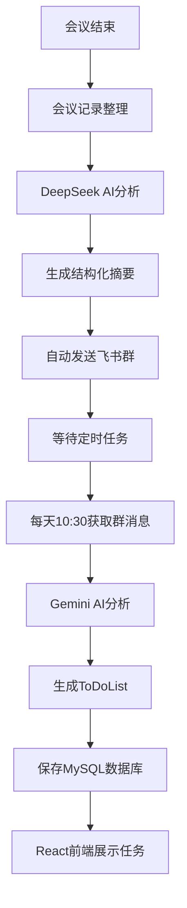

# 🚀 Feishu-TodoList

> 基于AI的智能飞书项目管理系统 - 从会议记录到任务管理的完整闭环解决方案

[](https://python.org)
[](https://fastapi.tiangolo.com)
[](https://reactjs.org)
[](LICENSE)
[](https://github.com/buildsense-ai/Feishu-TodoList)

## 📋 项目简介

Feishu-TodoList 是一个创新的AI驱动项目管理系统，专为团队协作和任务管理而设计。系统通过智能分析飞书群聊消息和会议记录，自动生成结构化的ToDoList，实现从会议讨论到任务分配的完整工作流自动化。

### 🌟 核心亮点

- **🤖 双AI智能分析**: DeepSeek处理会议记录 + Gemini 2.5分析群聊消息
- **📋 自动任务生成**: 智能提取并分类ToDo/Done/Issue任务
- **👥 精准人员识别**: 自动映射用户ID，精确分配给团队成员
- **🔄 完整闭环流程**: 会议记录 → AI分析 → 飞书群发送 → 消息获取 → ToDoList生成
- **💾 企业级数据管理**: MySQL存储，支持历史查询和工作负载分析
- **📊 可视化统计**: 团队工作负载分布和趋势分析
- **🌐 现代化界面**: React前端 + FastAPI后端的全栈解决方案

## 🎯 工作流程



### 📅 两个关键时间点

1. **会议后（实时处理）**: 会议记录 → AI分析 → 发送飞书群
2. **每日上午10:30（定时任务）**: 分析昨天10:30到今天10:30的所有消息 → 生成ToDoList

## 🏗️ 项目结构

```
Feishu-TodoList/
├── backend/                    # 后端Python代码
│   ├── feishu_api_server.py   # FastAPI主服务器
│   ├── ai_message_processor.py # AI消息分析器
│   ├── database_manager.py    # 数据库管理器
│   ├── feishu_message_fetcher.py # 飞书消息获取器
│   ├── feishu_bot_sender.py   # 飞书机器人发送器
│   ├── feishu_user_id_mapper.py # 用户ID映射器
│   ├── production_start.py    # 生产环境启动脚本
│   ├── requirements.txt       # Python依赖包
│   ├── start_server.sh       # Linux启动脚本
│   └── stop_server.sh        # Linux停止脚本
├── frontend/                   # 前端React应用
│   ├── src/                   # 源码目录
│   │   ├── App.js            # 主应用组件
│   │   ├── components/       # React组件
│   │   │   ├── Dashboard.js  # 仪表板组件
│   │   │   ├── MeetingUpload.js # 会议上传组件
│   │   │   └── SystemMonitor.js # 系统监控组件
│   │   └── index.js          # 应用入口
│   ├── public/               # 静态资源
│   ├── package.json          # Node.js依赖配置
│   └── package-lock.json     # 依赖版本锁定
├── README.md                  # 项目文档
├── README_Frontend.md         # 前端专用文档
├── API接口文档.md            # API接口说明
├── 项目结构说明.md           # 详细结构说明
├── start_dev.bat             # Windows快速启动脚本
└── .gitignore               # Git忽略配置
```

### 核心架构

```
┌─────────────────────────────────────────────────────────────┐
│                  Feishu-TodoList 系统架构                    │
├─────────────────────────────────────────────────────────────┤
│  🌐 前端展示层 (React)                                       │
│  ├── 任务看板界面                                            │
│  ├── 会议记录上传                                            │
│  └── 系统监控面板                                            │
├─────────────────────────────────────────────────────────────┤
│  🎤 会议记录处理层                                           │
│  ├── DeepSeek AI Engine (会议分析)                         │
│  ├── 结构化摘要生成                                          │
│  └── 飞书群自动发送                                          │
├─────────────────────────────────────────────────────────────┤
│  📱 飞书消息处理层                                           │
│  ├── 消息实时获取 (昨天10:30 → 今天10:30)                  │
│  ├── 用户ID智能映射                                          │
│  └── 文件下载管理                                            │
├─────────────────────────────────────────────────────────────┤
│  🤖 AI分析引擎层                                             │
│  ├── Gemini 2.5 消息分析                                    │
│  ├── 任务智能提取                                            │
│  └── 人员精准分配                                            │
├─────────────────────────────────────────────────────────────┤
│  💾 数据持久化层                                             │
│  ├── MySQL数据库存储                                         │
│  ├── 历史记录管理                                            │
│  └── 工作负载统计                                            │
├─────────────────────────────────────────────────────────────┤
│  🌐 API服务层 (FastAPI)                                      │
│  ├── RESTful接口服务                                         │
│  ├── 自动化API文档                                           │
│  └── 健康状态监控                                            │
└─────────────────────────────────────────────────────────────┘
```

### 技术栈

| 层级 | 技术选型 | 说明 |
|------|----------|------|
| **前端框架** | React 18+ | 现代化用户界面 |
| **后端框架** | FastAPI | 高性能异步Web框架 |
| **AI服务** | DeepSeek + Gemini 2.5 | 双AI引擎，分工明确 |
| **数据库** | MySQL 5.7+ | 企业级关系数据库 |
| **消息平台** | 飞书开放平台API | 企业级即时通讯 |
| **部署** | Python 3.8+ / Node.js 16+ | 全栈跨平台部署 |

## 👥 团队成员管理

系统专为5人团队设计，智能识别以下成员：

| 成员 | 职责 | AI识别关键词 |
|------|------|-------------|
| **Michael** | 前端UI | 前端、界面、UI、用户体验 |
| **小钟** | 后端数据库 | 后端、数据库、API、服务器 |
| **国伟** | 爬虫数据 | 爬虫、数据采集、数据处理 |
| **云起** | AI语音 | AI、语音、机器学习、模型 |
| **Gauz** | 架构性能 | 架构、性能、系统设计、优化 |

## 🚀 快速开始

### 1. 环境要求

**后端环境：**
- **Python**: 3.8+
- **MySQL**: 5.7+

**前端环境：**
- **Node.js**: 16+
- **npm**: 8+

**系统要求：**
- **内存**: 4GB+
- **网络**: 稳定的互联网连接

### 2. 克隆项目

```bash
git clone https://github.com/buildsense-ai/Feishu-TodoList.git
cd Feishu-TodoList
```

### 3. 后端设置

```bash
# 进入后端目录
cd backend

# 安装Python依赖
pip install -r requirements.txt

# 配置环境变量
# 编辑 feishu_api_server.py 中的配置：
```

```python
# 飞书应用配置
APP_ID = "your_feishu_app_id"
APP_SECRET = "your_feishu_app_secret"
DEFAULT_CONTAINER_ID = "your_group_chat_id"

# AI服务配置
DEEPSEEK_API_KEY = "your_deepseek_api_key"
```

### 4. 前端设置

```bash
# 进入前端目录
cd frontend

# 安装Node.js依赖
npm install

# 配置API地址（如需要）
# 编辑 src/config.js 中的后端API地址
```

### 5. 数据库设置

```sql
-- 创建数据库
CREATE DATABASE feishu_todolist;
CREATE DATABASE meeting_summaries_db;

-- 配置用户权限（可选）
GRANT ALL PRIVILEGES ON feishu_todolist.* TO 'your_user'@'localhost';
GRANT ALL PRIVILEGES ON meeting_summaries_db.* TO 'your_user'@'localhost';
```

### 6. 启动系统

#### 方式1：使用快速启动脚本（Windows推荐）

```bash
# 根目录下运行，自动启动后端和前端
start_dev.bat
```

#### 方式2：分别启动前后端

**启动后端：**
```bash
cd backend

# 生产环境启动（推荐）
python production_start.py

# 或开发环境启动
python feishu_api_server.py
```

**启动前端：**
```bash
cd frontend

# 开发环境启动
npm start

# 生产环境构建
npm run build
```

### 7. 验证安装

- **后端API文档**: http://localhost:8000/docs
- **后端健康检查**: http://localhost:8000/health
- **前端应用**: http://localhost:3000
- **系统状态**: 确认AI服务和数据库连接正常

## 💡 使用指南

### 🎤 会议记录处理

#### 方法1: 通过前端界面上传（推荐）

1. 访问 http://localhost:3000
2. 点击"会议记录上传"
3. 选择会议记录文件或粘贴文本
4. 点击"一键处理"，系统将自动：
   - AI分析会议内容
   - 保存到数据库
   - 发送摘要到飞书群

#### 方法2: API调用

```bash
# 上传会议记录文件，一键完成分析和发送
curl -X POST "http://localhost:8000/meeting/process-complete" \
  -F "file=@your_meeting_record.txt"
```

### 📋 ToDoList生成

#### 通过前端界面

1. 访问前端仪表板
2. 点击"生成今日ToDoList"
3. 查看按人员分组的任务列表

#### 通过API调用

```bash
# 生成每日ToDoList（分析昨天10:30到今天10:30的消息）
curl -X POST "http://localhost:8000/daily-todolist" \
  -H "Content-Type: application/json" \
  -d '{
    "container_id": "oc_58605a887f1e11e359ceec1782c2d12d",
    "download_files": false
  }'
```

### 📊 数据查询

```bash
# 获取最新ToDoList
curl "http://localhost:8000/db/latest-todolist"

# 查看团队工作负载统计（最近7天）
curl "http://localhost:8000/db/member-workload?days=7"

# 获取指定日期的任务汇总
curl "http://localhost:8000/db/daily-summary?target_date=2024-06-04"
```

## 📊 API接口文档

### 🔥 核心接口

| 端点 | 方法 | 功能 | 状态 |
|------|------|------|------|
| `/daily-todolist` | POST | 生成每日ToDoList | ⭐️ 主要 |
| `/meeting/process-complete` | POST | 完整会议记录处理 | ⭐️ 主要 |
| `/db/latest-todolist` | GET | 获取最新ToDoList | ✅ 稳定 |
| `/db/member-workload` | GET | 团队工作负载统计 | ✅ 稳定 |
| `/health` | GET | 系统健康检查 | ✅ 稳定 |

详细API文档请查看：[API接口文档.md](API接口文档.md)

## 🔧 部署指南

### 本地开发环境

**后端开发：**
```bash
cd backend
pip install -r requirements.txt
python feishu_api_server.py
```

**前端开发：**
```bash
cd frontend  
npm install
npm start
```

### 生产环境部署

#### 使用Docker（推荐）

**后端Dockerfile：**
```dockerfile
FROM python:3.9-slim
WORKDIR /app
COPY backend/requirements.txt .
RUN pip install -r requirements.txt
COPY backend/ .
EXPOSE 8000
CMD ["python", "production_start.py"]
```

**前端Dockerfile：**
```dockerfile
FROM node:16-alpine
WORKDIR /app
COPY frontend/package*.json ./
RUN npm install
COPY frontend/ .
RUN npm run build
EXPOSE 3000
CMD ["npm", "start"]
```

**Docker Compose：**
```yaml
version: '3.8'
services:
  backend:
    build: ./backend
    ports:
      - "8000:8000"
    environment:
      - MYSQL_HOST=mysql
    depends_on:
      - mysql
      
  frontend:
    build: ./frontend
    ports:
      - "3000:3000"
    depends_on:
      - backend
      
  mysql:
    image: mysql:5.7
    environment:
      MYSQL_ROOT_PASSWORD: yourpassword
      MYSQL_DATABASE: feishu_todolist
    ports:
      - "3306:3306"
```

#### 使用PM2进程管理

```bash
# 启动后端服务
cd backend
pm2 start feishu_api_server.py --name "feishu-backend"

# 启动前端服务
cd frontend
pm2 start npm --name "feishu-frontend" -- start
```

### 定时任务设置

```bash
# 添加到crontab，每天上午10:30自动生成ToDoList
30 10 * * * curl -X POST "http://localhost:8000/daily-todolist" -H "Content-Type: application/json" -d '{"container_id": "your_group_id", "download_files": false}'
```

## 📈 监控和维护

### 健康检查

```bash
# 后端健康状态
curl http://localhost:8000/health

# 数据库连接状态
curl http://localhost:8000/db/health

# 前端服务状态
curl http://localhost:3000
```

### 日志管理

```bash
# 查看后端日志
cd backend
tail -f logs/feishu-todolist.log

# 查看前端构建日志
cd frontend
npm run build --verbose
```

### 性能监控

- **API响应时间**: 监控关键接口性能
- **数据库连接**: 监控MySQL连接池状态
- **AI服务调用**: 监控DeepSeek/Gemini API调用成功率
- **前端性能**: 监控React应用加载和渲染性能
- **内存使用**: 监控前后端进程内存占用

## 🔒 安全考虑

### API密钥管理

```bash
# 使用环境变量存储敏感信息
export FEISHU_APP_SECRET="your_secret"
export DEEPSEEK_API_KEY="your_key"
export MYSQL_PASSWORD="your_password"
```

### 网络安全

- **HTTPS**: 生产环境强制使用HTTPS
- **CORS**: 配置正确的跨域访问策略
- **防火墙**: 限制端口访问来源
- **API限流**: 防止恶意调用和滥用

### 数据安全

- **数据加密**: 敏感数据存储加密
- **访问控制**: 实现基于角色的访问控制
- **审计日志**: 记录所有关键操作

## 🤝 贡献指南

### 开发流程

1. **Fork项目**: 点击右上角Fork按钮
2. **创建分支**: `git checkout -b feature/your-feature`
3. **提交代码**: `git commit -am 'Add your feature'`
4. **推送分支**: `git push origin feature/your-feature`
5. **创建PR**: 在GitHub上创建Pull Request

### 代码规范

- **Python**: 遵循PEP 8编码规范
- **JavaScript/React**: 遵循ESLint配置规范
- **注释**: 关键函数和组件需要详细注释
- **测试**: 新功能需要编写对应的测试用例
- **文档**: 更新相关文档说明

### 问题反馈

- **Bug报告**: 使用Issue模板报告问题
- **功能请求**: 详细描述需求和使用场景
- **改进建议**: 欢迎提出系统优化建议

## 📚 更多资源

### 官方文档

- [飞书开放平台](https://open.feishu.cn/document/)
- [DeepSeek API](https://platform.deepseek.com/api-docs/)
- [FastAPI文档](https://fastapi.tiangolo.com/)
- [React文档](https://reactjs.org/docs/)

### 项目文档

- [前端专用文档](README_Frontend.md)
- [API接口文档](API接口文档.md)
- [项目结构说明](项目结构说明.md)

### 社区支持

- **GitHub Issues**: [问题追踪和讨论](https://github.com/buildsense-ai/Feishu-TodoList/issues)
- **Wiki文档**: [详细使用说明](https://github.com/buildsense-ai/Feishu-TodoList/wiki)
- **示例项目**: [完整部署示例](https://github.com/buildsense-ai/Feishu-TodoList/tree/examples)

## 📄 许可证

本项目基于 [MIT License](LICENSE) 开源协议。

```
MIT License

Copyright (c) 2024 BuildSense AI

Permission is hereby granted, free of charge, to any person obtaining a copy
of this software and associated documentation files (the "Software"), to deal
in the Software without restriction, including without limitation the rights
to use, copy, modify, merge, publish, distribute, sublicense, and/or sell
copies of the Software, and to permit persons to whom the Software is
furnished to do so, subject to the following conditions:

The above copyright notice and this permission notice shall be included in all
copies or substantial portions of the Software.

THE SOFTWARE IS PROVIDED "AS IS", WITHOUT WARRANTY OF ANY KIND, EXPRESS OR
IMPLIED, INCLUDING BUT NOT LIMITED TO THE WARRANTIES OF MERCHANTABILITY,
FITNESS FOR A PARTICULAR PURPOSE AND NONINFRINGEMENT. IN NO EVENT SHALL THE
AUTHORS OR COPYRIGHT HOLDERS BE LIABLE FOR ANY CLAIM, DAMAGES OR OTHER
LIABILITY, WHETHER IN AN ACTION OF CONTRACT, TORT OR OTHERWISE, ARISING FROM,
OUT OF OR IN CONNECTION WITH THE SOFTWARE OR THE USE OR OTHER DEALINGS IN THE
SOFTWARE.
```

## 🎉 更新日志

### v2.7.0 (最新)
- ✨ 新增React前端用户界面
- 🏗️ 重构项目结构，分离前后端
- 📊 增强数据可视化功能
- 🔧 优化部署和开发体验

### v2.6.0
- 🤖 集成DeepSeek AI处理会议记录
- 📝 完整会议记录处理流程
- 💾 MySQL数据库存储优化

---

**🚀 快速体验：** 运行 `start_dev.bat` 一键启动完整系统！ 