# 🚀 Feishu-TodoList

> 基于AI的智能飞书项目管理系统 - 从会议记录到任务管理的完整闭环解决方案

[](https://python.org)
[](https://fastapi.tiangolo.com)
[](LICENSE)
[](https://github.com/buildsense-ai/Feishu-TodoList)

## 📋 项目简介

Feishu-TodoList 是一个创新的AI驱动项目管理系统，专为团队协作和任务管理而设计。系统通过智能分析飞书群聊消息和会议记录，自动生成结构化的ToDoList，实现从会议讨论到任务分配的完整工作流自动化。

### 🌟 核心亮点

- **🤖 双AI智能分析**: DeepSeek处理会议记录 + Gemini 2.5分析群聊消息
- **📋 自动任务生成**: 智能提取并分类ToDo/Done/Issue任务
- **👥 精准人员识别**: 自动映射用户ID，精确分配给团队成员
- **🔄 完整闭环流程**: 会议记录 → AI分析 → 飞书群发送 → 消息获取 → ToDoList生成
- **💾 企业级数据管理**: MySQL存储，支持历史查询和工作负载分析
- **📊 可视化统计**: 团队工作负载分布和趋势分析

## 🎯 工作流程

```mermaid
graph TB
    A[会议结束] --> B[会议记录整理]
    B --> C[DeepSeek AI分析]
    C --> D[生成结构化摘要]
    D --> E[自动发送飞书群]
    E --> F[等待定时任务]
    F --> G[每天10:30获取群消息]
    G --> H[Gemini AI分析]
    H --> I[生成ToDoList]
    I --> J[保存MySQL数据库]
    J --> K[团队查看任务分配]
```



### 📅 两个关键时间点

1. **会议后（实时处理）**: 会议记录 → AI分析 → 发送飞书群
2. **每日上午10:30（定时任务）**: 分析昨天10:30到今天10:30的所有消息 → 生成ToDoList

## 🏗️ 系统架构

### 核心组件

```
┌─────────────────────────────────────────────────────────────┐
│                    Feishu-TodoList 系统架构                  │
├─────────────────────────────────────────────────────────────┤
│  🎤 会议记录处理层                                           │
│  ├── DeepSeek AI Engine (会议分析)                         │
│  ├── 结构化摘要生成                                          │
│  └── 飞书群自动发送                                          │
├─────────────────────────────────────────────────────────────┤
│  📱 飞书消息处理层                                           │
│  ├── 消息实时获取 (昨天10:30 → 今天10:30)                  │
│  ├── 用户ID智能映射                                          │
│  └── 文件下载管理                                            │
├─────────────────────────────────────────────────────────────┤
│  🤖 AI分析引擎层                                             │
│  ├── Gemini 2.5 消息分析                                    │
│  ├── 任务智能提取                                            │
│  └── 人员精准分配                                            │
├─────────────────────────────────────────────────────────────┤
│  💾 数据持久化层                                             │
│  ├── MySQL数据库存储                                         │
│  ├── 历史记录管理                                            │
│  └── 工作负载统计                                            │
├─────────────────────────────────────────────────────────────┤
│  🌐 API服务层                                                │
│  ├── FastAPI RESTful接口                                    │
│  ├── 自动化API文档                                           │
│  └── 健康状态监控                                            │
└─────────────────────────────────────────────────────────────┘
```

### 技术栈

| 层级 | 技术选型 | 说明 |
|------|----------|------|
| **后端框架** | FastAPI | 高性能异步Web框架 |
| **AI服务** | DeepSeek + Gemini 2.5 | 双AI引擎，分工明确 |
| **数据库** | MySQL 5.7+ | 企业级关系数据库 |
| **消息平台** | 飞书开放平台API | 企业级即时通讯 |
| **部署** | Python 3.8+ | 跨平台部署支持 |

## 👥 团队成员管理

系统专为5人团队设计，智能识别以下成员：

| 成员 | 职责 | AI识别关键词 |
|------|------|-------------|
| **Michael** | 前端UI | 前端、界面、UI、用户体验 |
| **小钟** | 后端数据库 | 后端、数据库、API、服务器 |
| **国伟** | 爬虫数据 | 爬虫、数据采集、数据处理 |
| **云起** | AI语音 | AI、语音、机器学习、模型 |
| **Gauz** | 架构性能 | 架构、性能、系统设计、优化 |

## 🚀 快速开始

### 1. 环境要求

- **Python**: 3.8+
- **MySQL**: 5.7+
- **内存**: 4GB+
- **网络**: 稳定的互联网连接

### 2. 克隆项目

```bash
git clone https://github.com/buildsense-ai/Feishu-TodoList.git
cd Feishu-TodoList
```

### 3. 安装依赖

```bash
pip install -r requirements.txt
```

### 4. 配置环境

编辑 `feishu_api_server.py` 中的配置：

```python
# 飞书应用配置
APP_ID = "your_feishu_app_id"
APP_SECRET = "your_feishu_app_secret"
DEFAULT_CONTAINER_ID = "your_group_chat_id"

# AI服务配置
OPENROUTER_API_KEY = "your_openrouter_api_key"
```

### 5. 数据库设置

```sql
-- 创建数据库
CREATE DATABASE feishu_todolist;
CREATE DATABASE meeting_summaries_db;

-- 配置用户权限（可选）
GRANT ALL PRIVILEGES ON feishu_todolist.* TO 'your_user'@'localhost';
GRANT ALL PRIVILEGES ON meeting_summaries_db.* TO 'your_user'@'localhost';
```

### 6. 启动系统

```bash
# 方式1：生产环境启动（推荐）
python production_start.py

# 方式2：开发环境启动
python feishu_api_server.py
```

### 7. 验证安装

- **API文档**: http://localhost:8000/docs
- **健康检查**: http://localhost:8000/health
- **系统状态**: 确认AI服务和数据库连接正常

## 💡 使用指南

### 🎤 会议记录处理

#### 方法1: 文件上传（推荐）

```bash
# 上传会议记录文件，一键完成分析和发送
curl -X POST "http://localhost:8000/meeting/process-complete" \
  -F "file=@your_meeting_record.txt"
```

#### 方法2: 文本分析

```bash
# 直接分析会议记录文本
curl -X POST "http://localhost:8000/meeting/analyze" \
  -H "Content-Type: application/json" \
  -d '{"transcript": "会议记录内容..."}'
```

### 📋 ToDoList生成

```bash
# 生成每日ToDoList（分析昨天10:30到今天10:30的消息）
curl -X POST "http://localhost:8000/daily-todolist" \
  -H "Content-Type: application/json" \
  -d '{
    "container_id": "oc_58605a887f1e11e359ceec1782c2d12d",
    "download_files": false
  }'
```

### 📊 数据查询

```bash
# 获取最新ToDoList
curl "http://localhost:8000/db/latest-todolist"

# 查看团队工作负载统计（最近7天）
curl "http://localhost:8000/db/member-workload?days=7"

# 获取指定日期的任务汇总
curl "http://localhost:8000/db/daily-summary?target_date=2024-06-04"
```

## 📊 API接口文档

### 🔥 核心接口

| 端点 | 方法 | 功能 | 状态 |
|------|------|------|------|
| `/daily-todolist` | POST | 生成每日ToDoList | ⭐️ 主要 |
| `/meeting/process-complete` | POST | 完整会议记录处理 | ⭐️ 主要 |
| `/db/latest-todolist` | GET | 获取最新ToDoList | ✅ 稳定 |
| `/db/member-workload` | GET | 团队工作负载统计 | ✅ 稳定 |
| `/health` | GET | 系统健康检查 | ✅ 稳定 |

### 📋 ToDoList数据格式

```json
{
  "analysis_timestamp": "2024-06-04T13:42:57.723735",
  "analysis_type": "daily_todolist",
  "model": "google/gemini-2.5-pro-preview",
  "daily_todolist": {
    "ToDo": {
      "Michael": ["前端界面优化", "用户体验测试"],
      "小钟": ["数据库性能优化", "API开发"],
      "国伟": ["验证码识别方案研究"],
      "云起": ["AI模型训练数据收集"],
      "Gauz": ["系统监控模块开发"],
      "团队": ["代码评审机制建立"]
    },
    "Done": {
      "Michael": ["完成用户登录界面"],
      "小钟": ["用户认证模块上线"],
      "国伟": ["爬取70%目标数据"],
      "云起": ["语音识别准确率达95%"],
      "Gauz": ["数据库查询性能提升30%"]
    },
    "Issue": {
      "Michael": ["移动设备适配兼容性问题"],
      "小钟": ["高并发下API响应时间过长"],
      "国伟": ["动态验证码识别难题"],
      "云起": ["噪音环境下识别率下降"],
      "Gauz": ["数据库连接池配置需优化"]
    }
  },
  "message_count": 42,
  "status": "success"
}
```

详细API文档请查看：[API接口文档.md](API接口文档.md)

## 🔧 部署指南

### 本地开发环境

```bash
# 1. 安装依赖
pip install -r requirements.txt

# 2. 启动开发服务器
python feishu_api_server.py

# 3. 访问API文档
open http://localhost:8000/docs
```

### 生产环境部署

#### 使用Docker（推荐）

```dockerfile
# Dockerfile
FROM python:3.9-slim

WORKDIR /app
COPY requirements.txt .
RUN pip install -r requirements.txt

COPY . .
EXPOSE 8000

CMD ["python", "production_start.py"]
```

```bash
# 构建和运行
docker build -t feishu-todolist .
docker run -p 8000:8000 feishu-todolist
```

#### 使用PM2进程管理

```bash
# 安装PM2
npm install -g pm2

# 启动服务
pm2 start ecosystem.config.js

# 查看状态
pm2 status
pm2 logs feishu-todolist
```

#### 使用Nginx反向代理

```nginx
server {
    listen 80;
    server_name your-domain.com;

    location / {
        proxy_pass http://127.0.0.1:8000;
        proxy_set_header Host $host;
        proxy_set_header X-Real-IP $remote_addr;
        proxy_set_header X-Forwarded-For $proxy_add_x_forwarded_for;
    }
}
```

### 定时任务设置

```bash
# 添加到crontab，每天上午10:30自动生成ToDoList
30 10 * * * curl -X POST "http://localhost:8000/daily-todolist" -H "Content-Type: application/json" -d '{"container_id": "your_group_id", "download_files": false}'
```

## 📈 监控和维护

### 健康检查

```bash
# 系统健康状态
curl http://localhost:8000/health

# 数据库连接状态
curl http://localhost:8000/db/health
```

### 日志管理

```bash
# 查看系统日志
tail -f logs/feishu-todolist.log

# 错误日志过滤
grep "ERROR" logs/feishu-todolist.log
```

### 性能监控

- **API响应时间**: 监控关键接口性能
- **数据库连接**: 监控MySQL连接池状态
- **AI服务调用**: 监控OpenRouter API调用成功率
- **内存使用**: 监控Python进程内存占用

## 🔒 安全考虑

### API密钥管理

```bash
# 使用环境变量存储敏感信息
export FEISHU_APP_SECRET="your_secret"
export OPENROUTER_API_KEY="your_key"
export MYSQL_PASSWORD="your_password"
```

### 网络安全

- **HTTPS**: 生产环境强制使用HTTPS
- **防火墙**: 限制8000端口的访问来源
- **API限流**: 防止恶意调用和滥用

### 数据安全

- **数据加密**: 敏感数据存储加密
- **访问控制**: 实现基于角色的访问控制
- **审计日志**: 记录所有关键操作

## 🤝 贡献指南

### 开发流程

1. **Fork项目**: 点击右上角Fork按钮
2. **创建分支**: `git checkout -b feature/your-feature`
3. **提交代码**: `git commit -am 'Add your feature'`
4. **推送分支**: `git push origin feature/your-feature`
5. **创建PR**: 在GitHub上创建Pull Request

### 代码规范

- **Python**: 遵循PEP 8编码规范
- **注释**: 关键函数和类需要详细注释
- **测试**: 新功能需要编写对应的测试用例
- **文档**: 更新相关文档说明

### 问题反馈

- **Bug报告**: 使用Issue模板报告问题
- **功能请求**: 详细描述需求和使用场景
- **改进建议**: 欢迎提出系统优化建议

## 📚 更多资源

### 官方文档

- [飞书开放平台](https://open.feishu.cn/document/)
- [OpenRouter API](https://openrouter.ai/docs)
- [FastAPI文档](https://fastapi.tiangolo.com/)

### 社区支持

- **GitHub Issues**: [问题追踪和讨论](https://github.com/buildsense-ai/Feishu-TodoList/issues)
- **Wiki文档**: [详细使用说明](https://github.com/buildsense-ai/Feishu-TodoList/wiki)
- **示例项目**: [完整部署示例](https://github.com/buildsense-ai/Feishu-TodoList/tree/examples)

## 📄 许可证

本项目基于 [MIT License](LICENSE) 开源协议。

```
MIT License

Copyright (c) 2024 BuildSense AI

Permission is hereby granted, free of charge, to any person obtaining a copy
of this software and associated documentation files (the "Software"), to deal
in the Software without restriction, including without limitation the rights
to use, copy, modify, merge, publish, distribute, sublicense, and/or sell
copies of the Software, and to permit persons to whom the Software is
furnished to do so, subject to the following conditions:

The above copyright notice and this permission notice shall be included in all
copies or substantial portions of the Software.

THE SOFTWARE IS PROVIDED "AS IS", WITHOUT WARRANTY OF ANY KIND, EXPRESS OR
IMPLIED, INCLUDING BUT NOT LIMITED TO THE WARRANTIES OF MERCHANTABILITY,
FITNESS FOR A PARTICULAR PURPOSE AND NONINFRINGEMENT. IN NO EVENT SHALL THE
AUTHORS OR COPYRIGHT HOLDERS BE LIABLE FOR ANY CLAIM, DAMAGES OR OTHER
LIABILITY, WHETHER IN AN ACTION OF CONTRACT, TORT OR OTHERWISE, ARISING FROM,
OUT OF OR IN CONNECTION WITH THE SOFTWARE OR THE USE OR OTHER DEALINGS IN THE
SOFTWARE.
```

## 🌟 致谢

感谢以下开源项目和服务提供商：

- **FastAPI**: 提供高性能Web框架
- **OpenRouter**: 提供AI模型接口服务
- **飞书**: 提供企业级通讯平台
- **MySQL**: 提供可靠的数据库服务

---

<div align="center">

**🚀 立即体验 Feishu-TodoList，让AI为您的团队管理赋能！**

[⭐ Star](https://github.com/buildsense-ai/Feishu-TodoList) | [🐛 反馈问题](https://github.com/buildsense-ai/Feishu-TodoList/issues) | [📖 查看文档](https://github.com/buildsense-ai/Feishu-TodoList/wiki)

</div> 